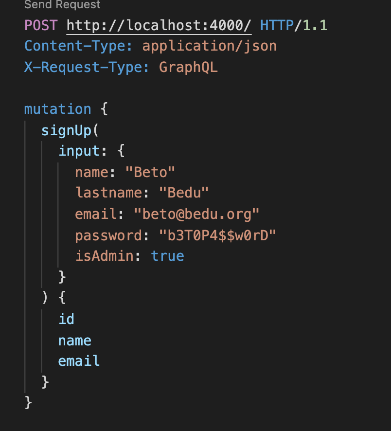
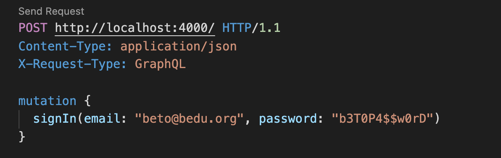
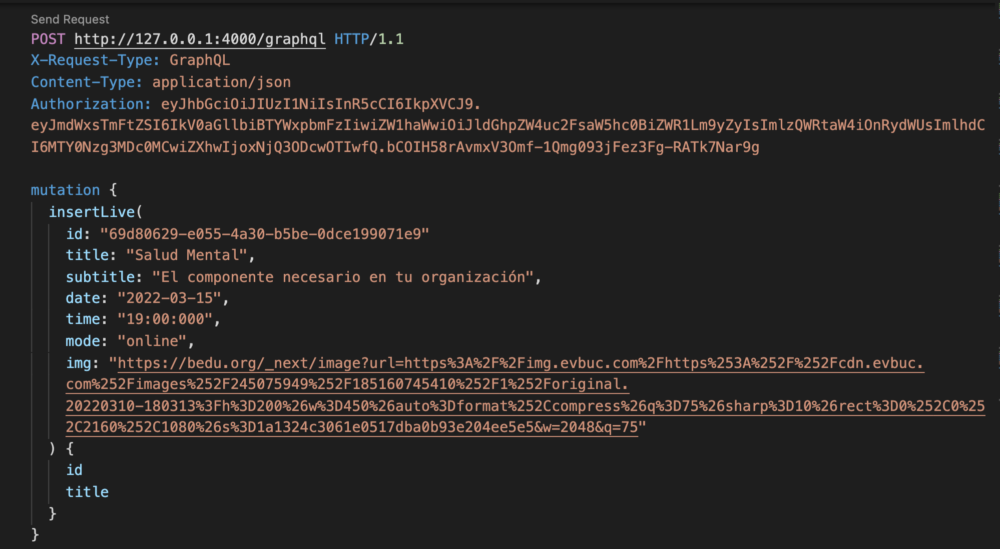
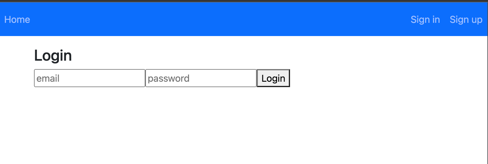
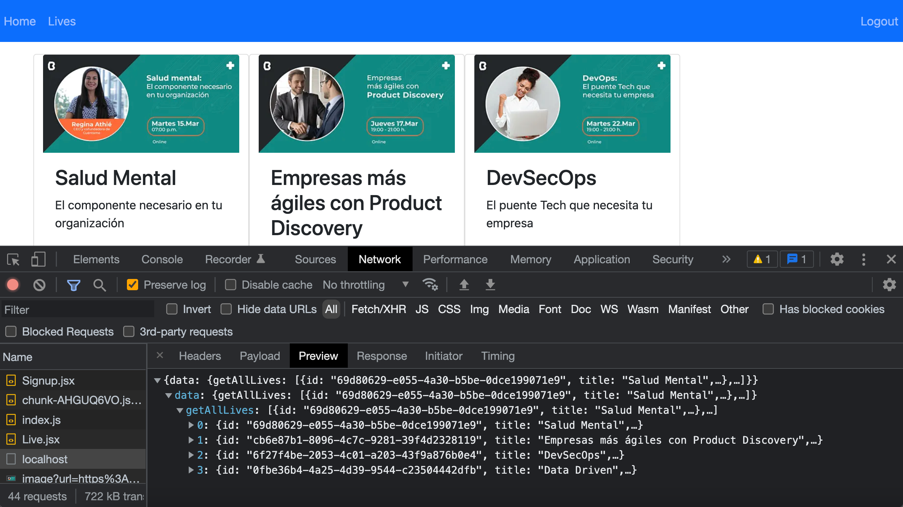

## Módulo: Backend con NodeJS.

### Objetivo
En este módulo te sumergirás en el ecosistema NodeJS de manera gradual. 
Conoceras los fundamentos y los módulos nativos de  NodeJS, así como modulos de terceros para crear aplicaciones que podrán ser ejecutadas tanto en la terminal como en el servidor.
Aprenderás a crear aplicaciones CLI y web con Javascript y también algunos de los conceptos y herramientas que han hecho crecer la popularidad de este lenguaje y la demanda de sus desarrolladores de manera acelerada.

### ¿Quién puede tomar este curso?

Cualquier persona interesada en aprender temas de nivel intermedio de Javascript y NodeJS.
No es obligatorio pero es recomendable tener una formación previa en alguna carrera de informática, un curso previo de programación o experiencia básica programando en javascript.

### Organización Del Módulo

- [Sesión 1: Fundamentos de Node.js](./sesion01)
- [Sesión 2: Introducción a GraphQL](./sesion02)
- [Sesión 3: Setup de un entorno de desarrollo](./sesion03)
- [Sesión 4: Introducción a Apollo Server](./sesion04)
- [Sesión 5: Persistencia en BD](./sesion05)
- [Sesión 6: Auth layer](./sesion06)
- [Sesión 7: Migración a TypeScript](./sesion07)
- [Sesión 8: Conexión de un cliente UI](./sesion08)

### Algunas operaciones a desarrollar en la API
#### signup mutation

#### signin mutation

#### insert live

### Conexión de la API con un cliente
#### interfaz para signin mutation

#### lives cards
